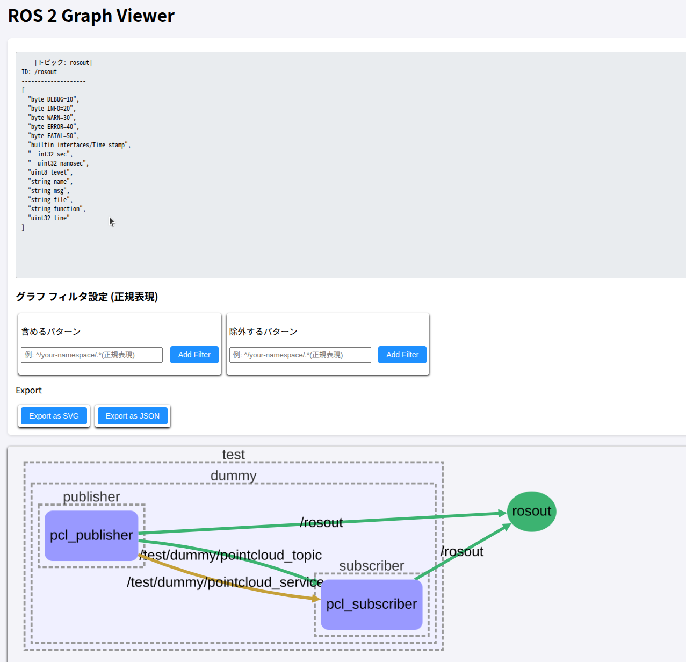
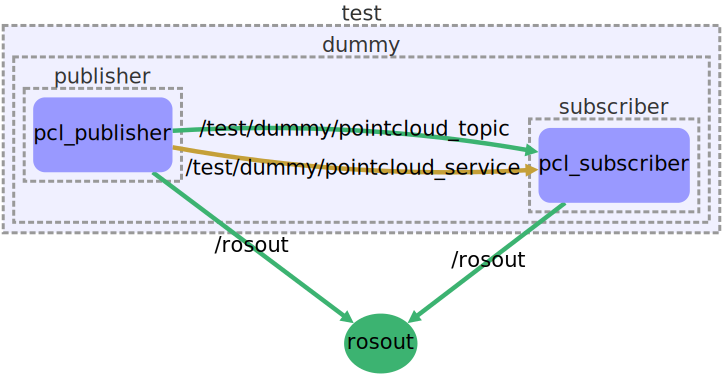

# ROS 2 Graph and State Viewer

## description

このリポジトリは、実行中の ROS 2 システムのネットワーク状態（ノード、トピック、サービス、接続、パラメータ）を CLI ツール (ros2) を介して収集し、インタラクティブなウェブグラフとして可視化するためのツール群を提供します。

- [Example](https://peeeechi.github.io/ros2_graph_and_state_viewer/index.html)



## Future

- ROS 2 状態の収集: Python スクリプト (ros2_state_dumper.py) により、ros2 node info, ros2 param list などの CLI コマンドを実行し、システムの接続状態、ノードのパラメータ、トピック/サービスのスキーマを JSON 形式でダンプします。
- インタラクティブなグラフ可視化: [Cytoscape.js](https://js.cytoscape.org/)、[cytoscape.js-elk](https://github.com/cytoscape/cytoscape.js-elk?tab=readme-ov-file)、[cytoscape.js-dagre](https://github.com/cytoscape/cytoscape.js-dagre) を使用し、収集した JSON データを動的なグラフとしてブラウザに表示します。
- 高度なフィルタリング: 正規表現を使用したノード/トピック/サービス名による **包含（Include）** ・ **除外（Exclude）** フィルタリング機能を搭載。
- コンテキストメニュー: グラフ上のノードを右クリックすることで、そのノードを即座にフィルタパターンに追加できます。
- エクスポート機能:
  - SVG エクスポート: 表示中のグラフを拡大縮小可能な SVG ファイルとしてエクスポートできます。
  - JSON エクスポート: 現在グラフに表示されている（フィルタリング後の）要素データ（ノード、接続など）を JSON ファイルとしてダウンロードできます。

## Usage

### Setup

#### Python 依存関係のインストール

グラフデータ生成スクリプト (ros2_state_dumper.py) と HTML 生成スクリプト (generate_graph_html.py) の実行に必要な依存関係をインストールします。

```bash
$ pip install -r ./requirements.txt
```

### Dump State

ROS 2 システム状態のダンプ (JSON 生成)
現在実行中の ROS 2 ネットワークから情報を収集し、ros2_graph_dump.json ファイルを生成します。

```bash
$ source /opt/ros/humble/setup.bash
$ source ${your-ros2-project}/install/setup.bash
$ python3 ./scripts/ros2_state_dumper.py
```

成功すると、カレントディレクトリに `ros2_graph_dump.json` が生成されます

### HTML ビューアの生成

生成された JSON データ (ros2_graph_dump.json) を HTML テンプレートに組み込み、グラフビューアファイル (output.html) を生成します。

```bash
python3 ./scripts/generate_graph_html.py ${path/to/ros2_graph_dump.json} -o ./output # -o Output dirctory
```

成功すると、output.html が生成されます

### HTML ビューアの使い方

#### グラフ要素の色分け

| 要素タイプ                     | 色                   | 意味                                    |
| :----------------------------- | :------------------- | :-------------------------------------- |
| **ノード (`.ros2_node`)**      | 青系 (`#9999ff`)     | ROS 2 の実行可能なコンポーネント。      |
| **トピック (`.ros2_topic`)**   | 緑系 (`#3CB371`)     | ノード間の非同期データストリーム。      |
| **サービス (`.ros2_service`)** | 黄土色系 (`#c5a039`) | ノード間の同期リクエスト/レスポンス。   |
| **トピックエッジ**             | 緑系 (`#3CB371`)     | トピックによる Publish/Subscribe 接続。 |
| **サービスエッジ**             | 黄土色系 (`#c5a039`) | サービスによる Call/Provide 接続。      |

#### フィルタリング機能

- 画面上部の**「含めるパターン」と「除外するパターン」**セクションを使用し、表示するノード/トピック/サービスを制御できます。
- 含めるパターン (Include): 1 つでもパターンにマッチする接続がある場合のみ、その接続を表示します。パターンが空の場合は、すべての要素を含めます（除外フィルタが優先されます）。
- 除外するパターン (Exclude): 1 つでもパターンにマッチする接続がある場合、その接続を表示しません。除外フィルタは包含フィルタよりも優先されます。
- コンテキストメニューからの追加:
  - グラフ上のノードを右クリックし、「含めるパターンにこの Node を追加」または「除外するパターンにこの Node を追加」を選択すると、そのノードの完全な ROS 2 名がフィルタとして即座に追加され、グラフが再描画されます。

### SVG の生成

「Export as SVG」ボタンをクリックすると、現在の状態の Node 図を下図のような SVG としてダウンロード出来ます。


